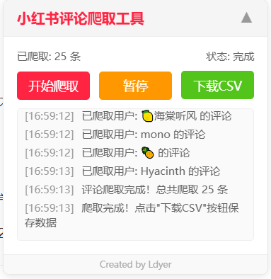
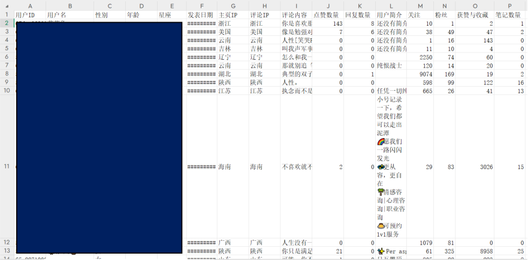
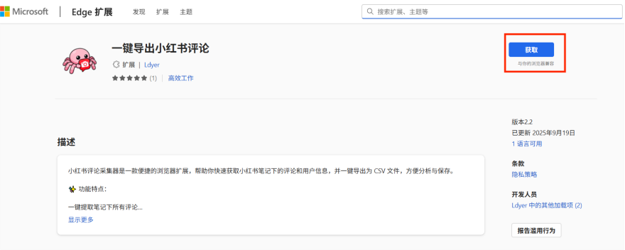
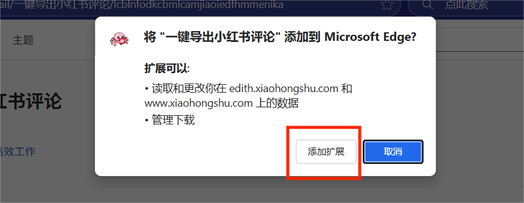
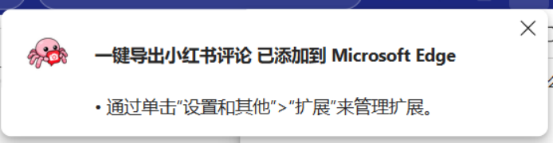
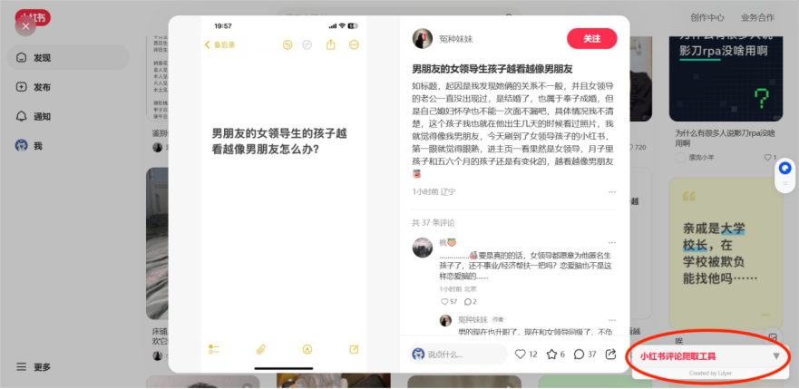
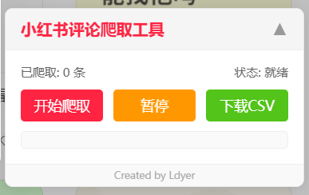
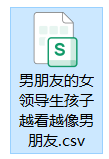

**博客文档** [【Edge扩展发布】一键导出小红书任意笔记/视频下的一级评论](https://ldyer.top/2025/09/22/%E5%B0%8F%E7%BA%A2%E4%B9%A6%E6%89%A9%E5%B1%95/)
**B站扩展** [bilibili-comments-extension](https://github.com/1dyer/bilibili-comments-extension)

# 1. 展示

## 1.1 使用界面



## 1.2 导出结果

为了保证隐私，此图的用户核心信息做了马赛克处理：



# 2. 使用教程

## 2.1 安装扩展

首先进入Edge浏览器，点击 **扩展** -> **获取Microsoft Edge扩展**


然后搜索`一键导出小红书评论`，或者直接访问链接：[一键导出小红书评论](https://microsoftedge.microsoft.com/addons/detail/%E4%B8%80%E9%94%AE%E5%AF%BC%E5%87%BA%E5%B0%8F%E7%BA%A2%E4%B9%A6%E8%AF%84%E8%AE%BA/lcblnfodkcbmlcamjiaoiedfhmmenika)


进入详细扩展页面后，依次点击按钮获取：





显示该信息，就说明扩展已经成功安装了：



## 2.2 具体使用

确保你已经登录了小红书网页版后，进入你要获取的评论页面，会显示工具的UI：



点击后，就会展开成如下UI，同理，再次点击后就会折叠：



点击 `开始爬取` 就会自动获取当前笔记的一级评论


点击 `暂停` 按钮，当前的爬取过程就会暂停，如果此时点击旁边的 `下载CSV` ，就会下载当前已经爬取的评论。

如果点击 `继续` 则会继续爬取数据。

点击 `下载CSV` 后，选择你需要下载到的路径，之后CSV文件就会保存到这个路径了，文件的名称就是笔记标题的名称：



# 3. 问题说明

- **为什么只能获取一级评论？**

> 因为小红书的一级评论获取较为容易，而它的二级评论获取不像B站那样轻松，它需要更进一步的JS逆向获取，一方面用浏览器扩展进行深层次的逆向较为复杂，另一方面是因为作者太菜了，不会...(⊙︿⊙)

- **为什么个别评论的IP地址会为空？**

> 因为小红书的IP获取机制比较奇怪，如果某个人的评论时间超过3个月以上，那么小红书系统会屏蔽ta的IP显示，如果某个人一个月内不评论/点赞/发动态，那么ta的主页IP也会不显示。

- **为什么爬取的数据中，关于用户的信息都为空了？**

> 这是可能是因为你在一定时间内获取的数据过多，触发了小红书的反爬机制，你可以换个账号或者等待一段时间过后再获取。

- **为什么获取速度不能再快点？**

> 每条评论获取的速度和你的网速有关。同时，作者在代码中也控制着爬取速度，一方面是因为高频从小红书系统获取评论不太道德，另一方面也是尽量避免触发反爬机制。

- **为什么信息不全？**

> 你可以会注意到，一些信息，如年龄、星座并不是每个人都有的，这是因为本项目只获取用户**公开**的信息，如果用户自身隐藏了信息，则不会获取。


# 4. 使用场景

**请在使用本软件前仔细阅读并理解以下全部内容。一旦您下载、安装、运行或以任何方式使用本软件，即表示您已完全理解、同意并接受本声明的所有条款。如您不同意本声明的任何内容，请立即停止使用并卸载本软件。**

## 4.1 性质与用途声明

本软件是一个 `技术工具` ，旨在通过 `合法、合规`的技术手段，辅助小红书笔记博主便捷地导出和管理其本人发布笔记下的评论数据。**本软件不提供任何绕过平台正常访问限制或获取非公开数据的功能。**

用户必须是其欲导出评论的小红书笔记的原创博主本人，或已获得博主的明确、书面授权。**严禁导出和分析任何非本人/未授权账号下的评论数据。**

## 4.2 限定用途

导出的数据仅限用于以下目的：

- 博主自我分析：

用于博主对自身内容流量、粉丝群体画像、互动趋势进行统计分析，以优化内容策略。

- 学术研究：

用于符合学术伦理和规范的科学研究，例如传播学、社会学、心理学、新闻学、数据科学等领域的研究。进行此类研究时，用户有责任确保其研究活动遵守相关法律法规及所在学术机构的伦理审查要求。

## 4.3 用户警告与禁止事项

- 您在使用本软件及导出数据时，必须严格遵守以下规定，否则可能面临法律风险：

遵守平台规定：您必须严格遵守 **《小红书用户服务协议》、《小红书社区公约》** 及所有相关平台规则。任何使用本软件进行的数据抓取行为不得对小红书平台的服务造成过度负担或干扰，否则可能导致您的账号被平台封禁。本软件的开发者和提供者不对因用户违反平台规定而导致的任何**后果负责**。

- 尊重用户隐私与数据安全：

匿名化与脱敏处理：在公开分享、发表研究报告或进行任何形式的数据传播前，必须对导出的评论数据进行严格的**匿名化和脱敏处理**。这意味着需要彻底移除所有可识别个人身份的信息，包括但不限于小红书用户名、用户ID、头像、个人简介、以及其他任何可能通过直接或间接方式定位到特定个人的内容。

- **禁止恶意使用：严禁将数据用于以下用途：**

对任何用户进行骚扰、人身攻击、网络暴力或人肉搜索。

进行商业营销、发送垃圾广告。

用于任何非法、欺诈、诽谤、侵犯他人合法权益的活动。

用于训练人工智能模型，除非已获得数据主体的明确授权。

**您必须确保数据的使用符合您所在国家/地区以及中华人民共和国相关法律法规的要求，特别是《中华人民共和国网络安全法》、《中华人民共和国数据安全法》和《中华人民共和国个人信息保护法（PIPL）》等。您对数据的处理、存储和使用的合法性负全部责任。**


# 5. 免责声明

- 数据准确性与完整性

本软件按“原样”提供。开发者不保证通过本软件导出的数据在准确性、完整性和时效性上没有任何瑕疵。数据可能因网络延迟、平台接口变动或其他不可抗力因素出现错误或遗漏。

- 法律责任豁免：

本软件的开发者（以下简称“我们”）不对用户使用本软件及导出数据的行为所产生的任何直接、间接、偶然、特殊或惩罚性的损害承担任何责任。这包括但不限于：

因用户违反小红书平台规定而导致账号被封禁或遭受其他损失。

因用户未能妥善保管或处理数据，导致数据泄露、滥用而引发的任何法律纠纷、索赔或处罚。

用户之间或因用户与第三方之间因数据使用而产生的任何争议。

因软件存在漏洞、服务中断或停止更新而导致的任何损失。

- 技术风险自担：

用户应自行承担使用本软件可能带来的技术风险（如兼容性问题、系统崩溃等），并自行做好数据备份。我们有权在不事先通知的情况下更新、修改或终止软件的服务。

- 学术伦理责任：

如将数据用于学术研究，用户（研究者）需独立承担研究过程中的所有伦理责任，包括但不限于获得所在机构伦理委员会的批准、确保数据处理方式符合学术规范等。本软件仅为数据获取工具，不提供任何伦理或方法论上的背书。

# 6. 核心代码

## 6.1 Github地址

[xhs-comments-extension](https://github.com/1dyer/xhs-comments-extension)

## 6.2 Python源码

本人独立设计并实现了该程序的完整Python代码，然后通过AI大模型，将Python代码封装成了浏览器扩展文件，以下是Python源码。

```python

import requests
import re
import json
import time
import csv


def get_header():
    header = {}
    with open("./xhs_cookie.txt") as f:
        header["Cookie"] = f.read()
        header['user-agent'] = 'Mozilla/5.0 (Windows NT 10.0; Win64; x64) AppleWebKit/537.36 (KHTML, like Gecko) Chrome/140.0.0.0 Safari/537.36 Edg/140.0.0.0'
        header['Referer'] = "https://www.xiaohongshu.com/"
    return header


# 用户信息获取
def get_user(user_id, xsec_token):
    try:
        user_url = f'https://www.xiaohongshu.com/user/profile/{user_id}?xsec_token={xsec_token}&xsec_source=pc_comment'
        resp = requests.get(url=user_url, headers=get_header(), timeout=10)
        resp.raise_for_status()
        data_text = resp.content.decode('utf-8')
        matched = re.findall(r'<script>(.+?)</script>', data_text)
        if not matched:
            return '', '', '', '', '', '', '', '', ''
        user_data = json.loads(
            matched[-1].replace('window.__INITIAL_STATE__=', '').replace("undefined", "null")
        )['user']

        basic_info = user_data.get('userPageData', {}).get('basicInfo', {})
        interactions = user_data.get('userPageData', {}).get('interactions', [])
        notes = user_data.get('notes', [])

        # 主页IP
        ipLocation = basic_info.get('ipLocation', '')
        # 简介
        desc = basic_info.get('desc', '')
        # 性别
        gender_code = basic_info.get('gender')
        if gender_code == 0:
            gender = "男"
        elif gender_code == 1:
            gender = "女"
        else:
            gender = ''
        # 年龄和星座
        age = ''
        constellation = ''
        for tag in user_data.get('userPageData', {}).get('tags', []):
            tag_name = tag.get('name', '')
            if "岁" in tag_name:
                age = tag_name
            elif "座" in tag_name:
                constellation = tag_name

        # 关注 / 粉丝 / 获赞与收藏
        follows = interactions[0].get('count') if len(interactions) > 0 else ''
        fans = interactions[1].get('count') if len(interactions) > 1 else ''
        interaction = interactions[2].get('count') if len(interactions) > 2 else ''

        # 笔记数量
        notes_counts = len(notes[0]) if notes else 0
        if notes_counts >= 30:
            notes_counts = "30+"

        return gender, age, constellation, ipLocation, desc, follows, fans, interaction, notes_counts

    except Exception as e:
        print(f"[用户信息获取失败] user_id={user_id}, 错误: {e}")
        # 返回 9 个空值，保持一致
        return '', '', '', '', '', '', '', '', ''


# 获取整体评论并写入CSV
def get_data(note_id, xsec_token, cursor, top_comment_id, writer, counter):
    try:
        comments_url = f'https://edith.xiaohongshu.com/api/sns/web/v2/comment/page?note_id={note_id}&cursor={cursor}&top_comment_id={top_comment_id}&image_formats=jpg,webp,avif&xsec_token={xsec_token}'
        resp = requests.get(url=comments_url, headers=get_header(), timeout=10)
        resp.raise_for_status()
        xhs_data = json.loads(resp.content.decode('utf-8')).get('data', {})
    except Exception as e:
        print(f"[评论获取失败] cursor={cursor}, 错误: {e}")
        return

    for comment in xhs_data.get('comments', []):
        try:
            # 用户ID
            user_id = comment.get('user_info', {}).get('user_id', '')
            # 用户xsec_token
            user_xsec_token = comment.get('user_info', {}).get('xsec_token', '')
            # 用户名
            nickname = comment.get('user_info', {}).get('nickname', '')
            # 评论内容
            content = comment.get('content', '')
            # 发表日期
            create_time = comment.get('create_time', 0) / 1000
            create_time = time.strftime("%Y-%m-%d %H:%M:%S", time.localtime(create_time)) if create_time else ''
            # 评论IP
            ip_location = comment.get('ip_location', '')
            # 点赞数量
            like_count = comment.get('like_count', 0)
            # 回复数量
            sub_comment_count = comment.get('sub_comment_count',0)

            # 获取用户信息
            gender, age, constellation, ipLocation, desc, follows, fans, interaction, notes_counts = get_user(user_id, user_xsec_token)

            # 写入一条数据到 CSV
            writer.writerow([
                user_id, nickname, gender, age, constellation, create_time, ipLocation,
                ip_location, content, like_count, sub_comment_count, desc, follows, fans, interaction, notes_counts
            ])
            counter[0] += 1  # 计数器加一
            print(counter[0])
        except Exception as e:
            print(f"[单条评论处理失败] 错误: {e}")
            continue

    if xhs_data.get('has_more'):
        cursor = xhs_data.get('cursor', '')
        get_data(note_id, xsec_token, cursor, top_comment_id, writer, counter)
    else:
        print(f"爬取结束！共获取 {counter[0]} 条评论。")


if __name__ == "__main__":
    # 爬取的笔记页面
    xhs_url = 'https://www.xiaohongshu.com/explore/6807a207000000001c0349ce?xsec_token=ABE20PARDYdv52Bzz987Zpv669XdId2hAAg5Vn8uBdovY=&xsec_source=pc_search&source=web_explore_feed'
    # 提取相关信息
    note_id = re.findall(r"/explore/(.+?)\?", xhs_url)[0]
    xsec_token = re.findall(r"xsec_token=(.+?)&", xhs_url)[0]
    cursor = ''
    top_comment_id = ''
    # 获取笔记标题
    title = re.findall(r'<title>(.+?) - 小红书</title>',requests.get(url=xhs_url,headers=get_header()).content.decode('utf-8'))[0]

    # 打开CSV文件并写入标题行
    with open(f'{title}.csv', "w", newline="", encoding="utf-8-sig") as f:
        writer = csv.writer(f)
        writer.writerow(["用户ID", "用户名", "性别", "年龄", "星座", "发表日期", "主页IP", "评论IP", "评论内容", "点赞数量", "回复数量", "用户简介", "关注", "粉丝", "获赞与收藏", "笔记数量"])
        counter = [0]  # 用列表来存计数器（方便递归修改）
        get_data(note_id, xsec_token, cursor, top_comment_id, writer, counter)


```